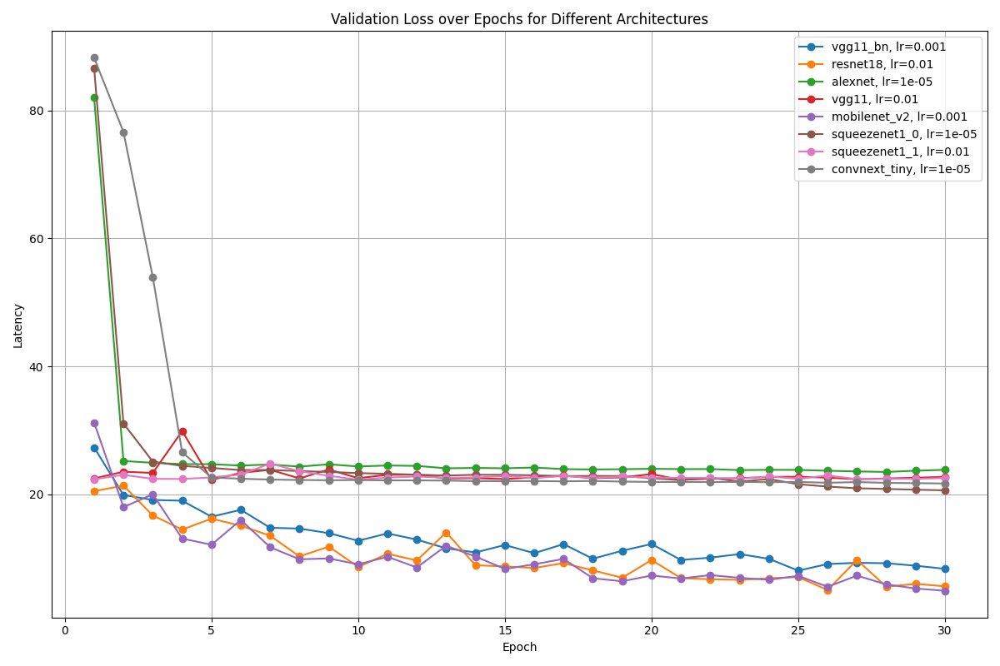
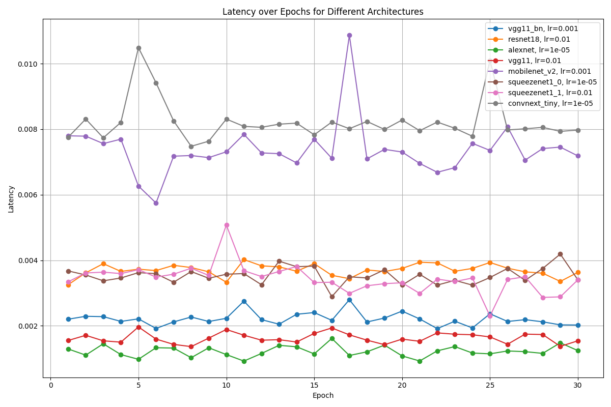
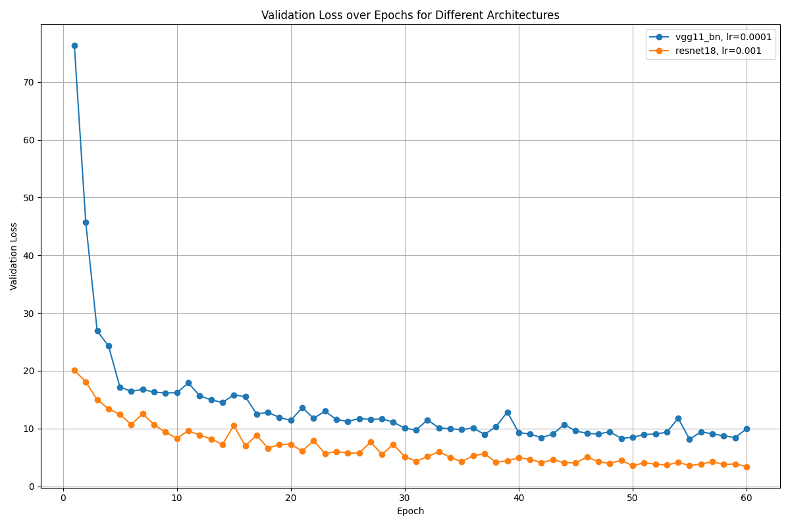
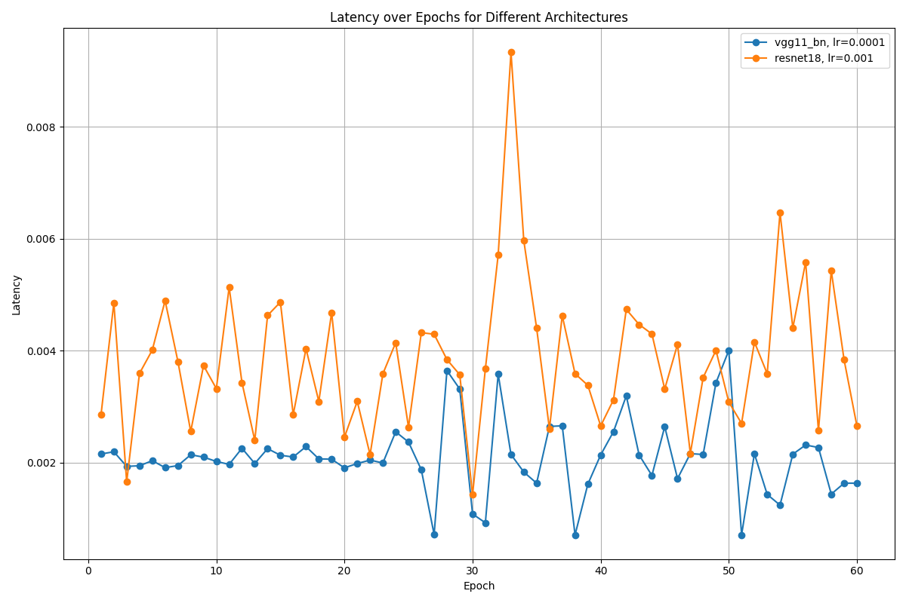

# Neural Architecture and Hyperparameter Search for Faca Bounding Box Prediction on Edge

## Overview
In this project, the goal was to optimize a neural network architecture for face bounding box
prediction using a given facial image dataset. The primary objective was to design a lightweight
and efficient model capable of performing inference on resource-constrained hardware, NVIDIA
Jetson Nano. Additionally, a competition through a Kaggle evaluated the architecture based on
their prediction accuracy and inference latency. Accuracy was quantified using Intersection over
Union (IoU), a metric that assesses the degree of overlap between the model's predicted
bounding boxes and the ground-truth coordinates. Latency evaluation was performed directly
on the NVIDIA Jetson Nano to accurately reflect performance in a realistic deployment scenario
---
## Solution
In order to identify the optimal neural network architecture and corresponding
hyperparameters, I conducted a structured neural architecture and hyperparameter search.
• The neural architecture search space included 21 different base CNN feature extractors.
• The hyperparameter research considered learning rates ranging from 1e-2 to 1e-5.
The network architecture employed a regression head consisting of two layers:
• The input layer received neurons from the selected base architecture and reduced the
dimensionality by half
• The output layer produced four values representing bounding box coordinates.
The search procedure was structured in three distinct stages.
➢ In the first stage, each combination of architecture and learning rate was trained and
evaluated for 10 epochs, after which I selected the top 8 architectures based on their
validation loss and inference latency. (there where 84 different configurations and I was
not able to plot the results effectively)
➢ In the second stage, these 8 selected architectures were further trained for 30 epochs
using their optimal learning rates identified from the initial stage. This stage narrowed
the selection down to the two best-performing architectures



Finally, the third stage involved extensive training of these two architectures over 60 epochs.
This allowed identification of the optimal architecture and learning rate for the bounding box
prediction task. 



## how to run:
### Clone The Repo:
```bash
git clone https://github.com/markshperkin/EdgeFaceSearch
cd EdgeFaceSearch
```

### *OPTIONAL* install and use Cuda for Nvidia GPU


### Enter the functions directory
```bash
cd scripts
```

### Start training
```bash
python .\train.py
```

### Start testing
```bash
python .\test.py
```
---
## Class Project

This project was developed as part of the Edge and Neuromorphic Computing class under the instruction of [Professor Ramtin Zand](https://sc.edu/study/colleges_schools/engineering_and_computing/faculty-staff/zand.php) and Teacher assistant [Peyton Chandarana](https://www.peytonsc.com/) at the University of South Carolina.


